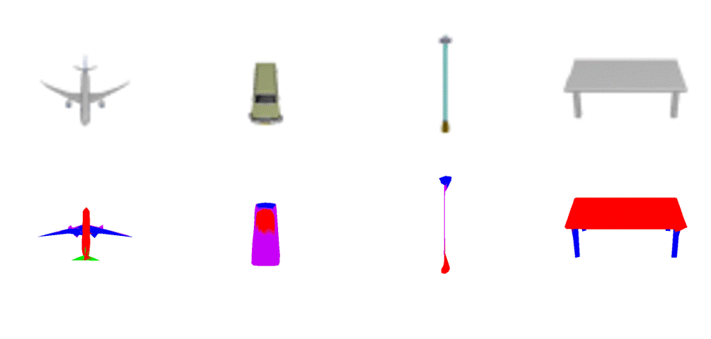

# 3D Partonomic Reconstruction
  

## Installation
### Create conda environment
```bash
conda env create -f environment.yml
conda activate partonomic
```
## Datasets
Please download our generated dataset at the following links:
| Dataset | Link |
|:----------:|:----------:|
| ShapeNetPart | |
| PartNet | |
| CUB-200-2011 | |
## Training

